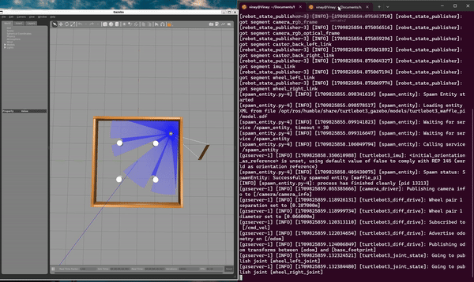

# Overview

The repository contains the procedure to execute an obstacle avoidance algorithm using ROS2 Humble with help of a turtlebot. The turtlebot navigates freely avoiding obstacles in simulation environment Gazebo by using the LIDAR sensor. Using the data received from the LIDAR sensor, the robot takes the next step whether to move forward or rotate to avoid the obstacle infront. Furthermore, this can be integrated to include start and goal node and make it follow along a path avoiding obstacles.

To execute the algorithm, follow the steps below. The initial method involves running the algorithm within a Docker image. By employing this method, the Docker image can be executed on any Ubuntu/Windows system, ensuring scalability and efficiency.


## Approach: Using Ubuntu 22 and ROS2 Humble

1. Move to the source directory of your ROS workspace. Also make sure you source into ROS humble and have Ubuntu 22 OS
```bash
    source /opt/ros/humble/setup.bash
    export TURTLEBOT3_MODEL=waffle_pi
```
2. Clone the repository using the command below. Use terminal in Ubuntu 
```bash
    git clone https://github.com/Rezov01Z/ros2_robot_planner_avoidance.git
    cd ros2_robot_planner_avoidance/
```
3. Run below commands to perform teleoperation
```bash
    # Terminal 1
    colcon build --packages-select obstacle_avoidance_tb3
    source install/setup.bash
    ros2 launch turtlebot3_gazebo turtlebot3_dqn_stage2.launch.py
    # Terminal 2
    source /opt/ros/humble/setup.bash
    source install/setup.bash
    ros2 run obstacle_avoidance_tb3 turtlebot_teleop.py
```
4. Run below commands to execute obstacle Avoidance algorithm
```bash
    # Terminal 1
    colcon build --packages-select obstacle_avoidance_tb3
    source install/setup.bash
    ros2 launch obstacle_avoidance_tb3 smart_navigation_launch.py goal_x:=2.0 goal_y:=1.0
```

5. Publish new goal for Robot
```bash
    # Terminal 2
    ros2 param set /smart_navigation goal_x -0.5 
    ros2 param set /smart_navigation goal_y -0.5 
```


## Results

All the result videos can be found in the result folder of the cloned directory.

<p align="center">

</p>


## References
1.  Gazebo Simulation Tutorials - https://emanual.robotis.com/docs/en/platform/turtlebot3/simulation/
2.  Python3 rocker - https://github.com/osrf/rocker
3.  Turtlebot3 teleop - https://github.com/ROBOTIS-GIT/turtlebot3/tree/humble-devel/turtlebot3_teleop
